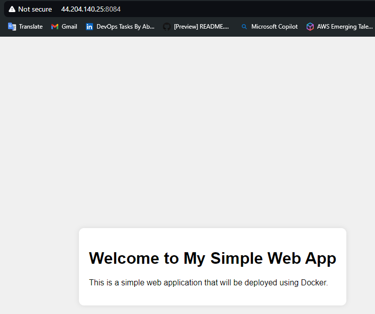
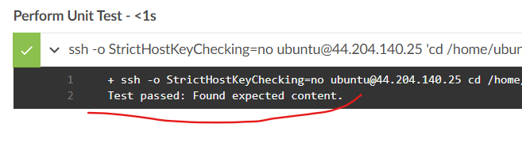
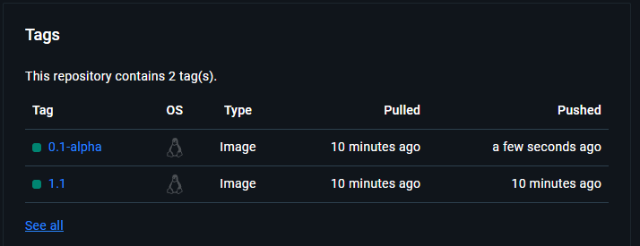
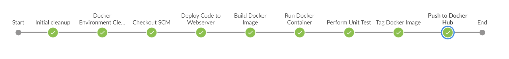

# Automating Deployment Of An E-Commerce Website

**Step 1 - Setup Infrastructure**
---

- Provision 2 EC2 instances; one for Jenkins (CI server) and the other for hosting the webapp (Webserver).

- Setup Jenkins on the Jenkins server and install necessary plugins.

- Configure webhook b/w GitHub and Jenkins and test to confirm it is working as expected.

- Setup ssh-agent to allow seamless connection b/w the Jenkins server and Webserver.


**Step 2 - Begin Jenkinsfile**
---

- Use a simple Jenkinsfile to test if the webhook is working as expected. It can also be used as a template which can be expanded with various build steps. Use this sample below:

```
pipeline {
    agent any

  stages {
    stage("Initial cleanup"){
      steps {
        dir("${WORKSPACE}") {
          deleteDir()
        }
      }
    }
    
    stage('Build') {
      steps {
        script {
          sh 'echo "Building Stage"'
        }
      }
    }
  }
}
```

- After the Jenkinsfile has been confirmed to be working, setup environment variables in the Jenkinsfile that would be used instead of hardcoding values. See sample below:

```
pipeline {
    agent any

    environment {
        DOCKERHUB_USERNAME = credentials('dockerhub-username')
        DOCKERHUB_PASSWORD = credentials('dockerhub-password')
        REPO_URL = 'https://github.com/jaymineh/Jenkins-Pipeline-Simple.git'
        DOCKER_IMAGE = 'simple-webapp'
        DOCKER_TAG = '0.1-alpha'
        CONTAINER_NAME = 'ecomm-webapp'
        PORT_MAP = '8084:80'
        EC2_IP = '44.204.140.25'
        DOCKER_DIR = '/home/ubuntu/Jenkins-Pipeline-Simple'
        move = 'ssh -o StrictHostKeyChecking=no'
    }
```

- Deploy code to webserver where the code would be built. The code below checks out the main branch and clones the repo on the webserver for it to be built in the next stage:

```
        stage('Checkout SCM') {
            steps {
                git branch: 'main', url: "${REPO_URL}"
            }
        }

        stage('Deploy Code to Webserver') {
            steps {
                sshagent (['webserver']) {
                sh "${move} ubuntu@${EC2_IP} 'git clone ${REPO_URL}'" }
            }
        }
```

*Note that the `webserver` being referenced where sshagent is declared is actually a credential that is stored on Jenkins. The sshagent is basically calling the secret/key behing the `webserver` variable for authentication.*

*Also, `StrictHostKeyChecking=no` is appended to the ssh command in `ssh -o StrictHostKeyChecking=no` to solve an error where the host could not be verified. The `.ssh` folder may also need to be copied to `/var/lib/jenkins` and ownership changed to Jenkins so it can read the known hosts and keys in the `.ssh` folder. Another alternative is adding the jenkins user to the group owner of the `.ssh` folder.*


**Step 3 - Containerization**
---

- Create a dockerfile which would be used to build the app. See dockerfile below:

```
# Use an official nginx image as the base image
FROM nginx:alpine

# Copy the HTML file to the nginx html directory
COPY webapp.html /usr/share/nginx/html/webapp.html

# Copy a custom nginx configuration file to the container
COPY nginx.conf /etc/nginx/conf.d/default.conf

# Expose port 80
EXPOSE 80

# Start nginx server
CMD ["nginx", "-g", "daemon off;"]
```

- Run the stage below to build the dockerfile. Note that the `webapp.html` and `nginx.conf` files must have been checkout to the repository and downloaded onto the webserver.

```
stage('Build Docker Image') {
            steps {
                sshagent (['webserver']) {
                sh "${move} ubuntu@${EC2_IP} 'cd ${DOCKER_DIR}; sudo docker build -t ${DOCKER_IMAGE} .'" }
            }
        }
```

- After the dockerfile has been built, include the next stage to run the docker image:

```
stage('Run Docker Container') {
            steps {
                sshagent (['webserver']) {
                sh "${move} ubuntu@${EC2_IP} 'cd ${DOCKER_DIR}; sudo docker run -d --name ${CONTAINER_NAME} -p ${PORT_MAP} ${DOCKER_IMAGE}'" }
            }
        }
```

- Test to confirm if the docker image is running successfully by checking the url on a browser. Use the public IP of the instance along with the mapped port.



*For Jenkins to be able to run docker commands on a remote server, it needs to have permissions on that server. To achieve this, a Jenkins user would need to be created on the remote webserver (which doesn't have Jenkins installed) and added to the docker group.*

- A new stage needs to be added to ensure that the docker environment is cleaned up on every pipeline run. This will prevent the pipeline from failing when the pipeline tries to build a new image when an existing one is running, with the same name. Use this code block below:

```
stage('Docker Environment Cleanup') {
            steps {
                sshagent (['webserver']) {
                sh "${move} ubuntu@${EC2_IP} 'rm -rf ${DOCKER_DIR}'"
                sh "${move} ubuntu@${EC2_IP} 'sudo docker rm -f ${CONTAINER_NAME}'"
                sh "${move} ubuntu@${EC2_IP} 'sudo docker rmi -f ${DOCKER_IMAGE}'"
                sh "${move} ubuntu@${EC2_IP} 'sudo docker rmi -f ${DOCKERHUB_USERNAME}/${DOCKER_IMAGE}:${DOCKER_TAG}'" }
            }
        }
```


**Step 4 - Unit Tests**
---

- Enable Jenkins run the `unit-tests.sh` script which would automatically check the image for expected content. See step below:

```
stage('Perform Unit Test') {
            steps {
                sshagent (['webserver']) {
                sh "${move} ubuntu@${EC2_IP} 'cd ${DOCKER_DIR}; chmod +x unit-test.sh; sh unit-test.sh'" }
            }
        }
```



*This stage can be expanded to include a condition that can break the pipeline if the unit test does not return the expected content. This would prevent the pipeline from uploading a "bad" image to the docker repository.*

*An observation with the running of the sh scripts is that single quotes are needed to run simultaneous commands on a remote server. If the single quotes were omitted, only the first part of the entire command would be executed on the remote host, with the rest being done locally. The ; are used in place of && to perform more than 1 command in the entire string.*

**Step 5 - Upload To Docker Repository**
---

- Before the image is uploaded to dockerhub, it needs to be tagged. This would enable the image to have a proper tag for versioning when uploaded. Use this step below:

```
stage('Tag Docker Image') {
            steps {
                sshagent (['webserver']) {
                sh "${move} ubuntu@${EC2_IP} 'sudo docker tag ${DOCKER_IMAGE} ${DOCKERHUB_USERNAME}/${DOCKER_IMAGE}:${DOCKER_TAG}'" }
            }
        }
```

- After the image is tagged, it is ready to be uploaded to dockerhub. Use the below code to login to dockerhub (account must exist) and upload the docker image to dockerhub.

```
stage('Push to Docker Hub') {
            steps {
                sshagent (['webserver']) {
                sh "${move} ubuntu@${EC2_IP} 'docker login -u=${DOCKERHUB_USERNAME} -p=${DOCKERHUB_PASSWORD}'"
                sh "${move} ubuntu@${EC2_IP} 'sudo docker push ${DOCKERHUB_USERNAME}/${DOCKER_IMAGE}:${DOCKER_TAG}'" }
            }
        }
```





**Project Completed Successfully!**